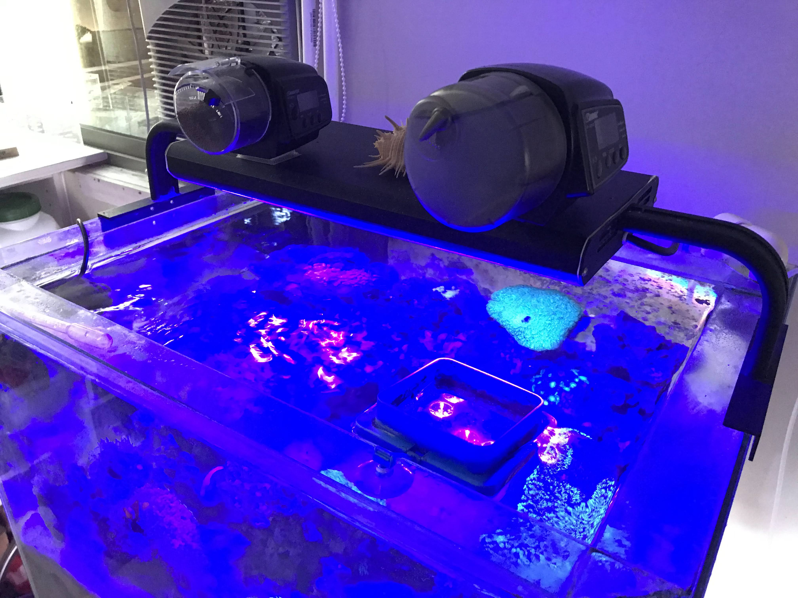
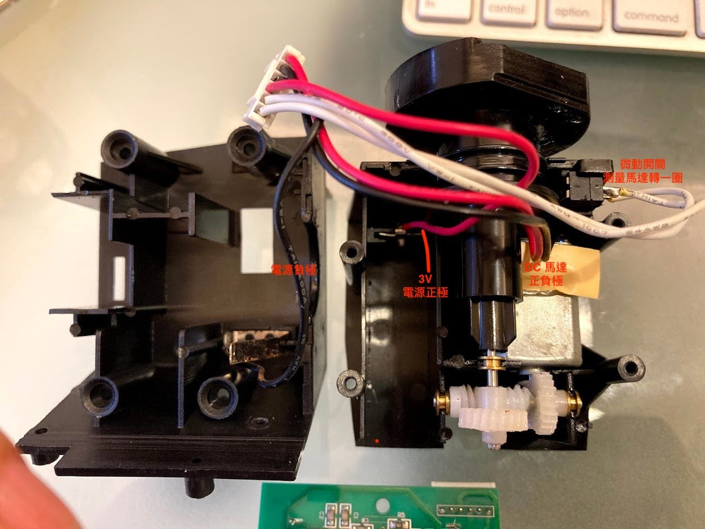
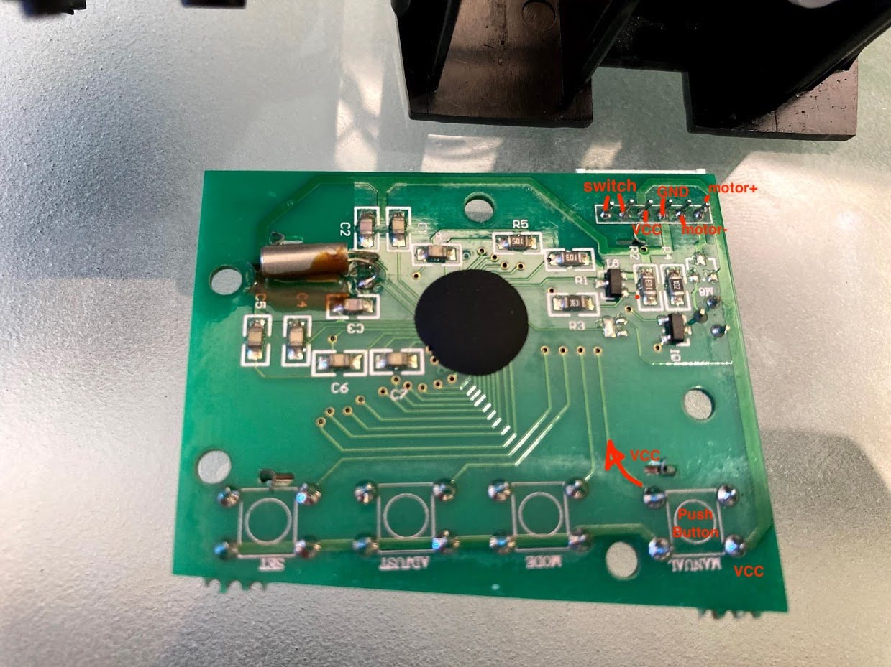
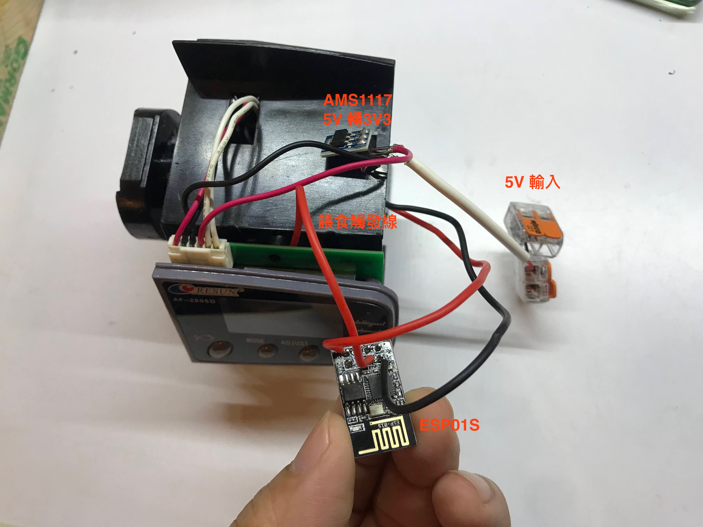
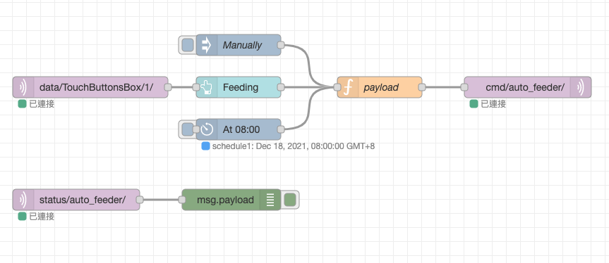

# RESUN auto feeder teardown and controlled with ESP01

## Wha did I do?
1. Teardown the RESUN auto feeder and analysis.
2. Use 5V cable as input power.
3. Use AMS1117 to convert 5V to 3V3 to power auto feeder and ESP01.
4. Use ESP01 GPIO2 pull high to trigger feeding action.
5. Use MQTT to send command to ESP01. (Of cause ESP01 need to connect to WiFi and MQTT Broker)
6. Use Node-Red Cron Job for feeding schedule.
7. Use Node-Red Dashboard for On-Demand feeding.

## Source Code
1. ESP01 
2. Node-Red Flow